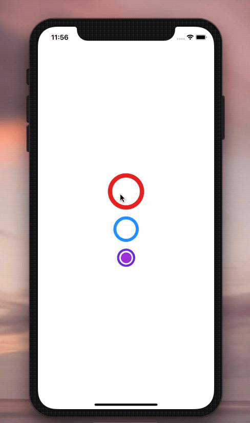
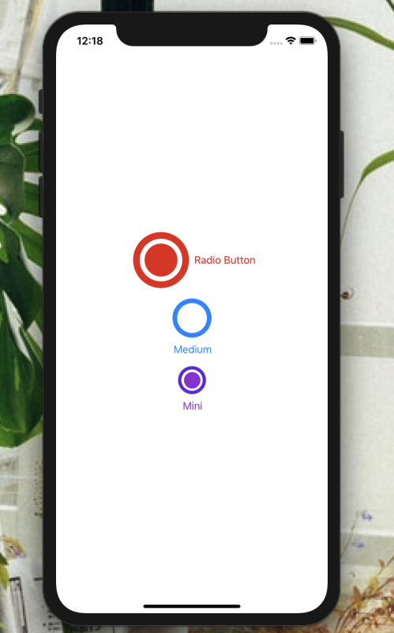

[](https://github.com/WrathChaos/react-native-animated-radio-button)

[](https://github.com/WrathChaos/react-native-animated-radio-button)

[](https://www.npmjs.com/package/react-native-animated-radio-button)
[](https://www.npmjs.com/package/react-native-animated-radio-button)

[](https://opensource.org/licenses/MIT)
[](https://github.com/prettier/prettier)

<p align="center">


</p>

# Installation

Add the dependency:

```bash
npm i react-native-animated-radio-button
```

## Peer Dependencies

###### IMPORTANT! You need install them

```js
"react-native-animatable": ">= 1.3.3"
```

# Usage

## Import

```jsx
import RadioButton from "react-native-animated-radio-button";
```

## Fundamental Usage

You can check the example out 😏

```jsx
<RadioButton
  size={50}
  isSelected
  animation={"bounceIn"}
  onPress={() => console.log("RadioButton is pressed")}
/>
```

# Configuration - Props

| Property                      |   Type    |   Default    | Description                                                                                                                            |
| ----------------------------- | :-------: | :----------: | -------------------------------------------------------------------------------------------------------------------------------------- |
| size                          |  number   |      16      | change the size of the radio button                                                                                                    |
| isSelected                    |  boolean  |    false     | set the selectable of the radio button                                                                                                 |
| isBounceable                  |  boolean  |     true     | enable or disable the bounceable effect                                                                                                |
| innerColor                    |   color   |  dodgerblue  | change the radio button's inner circle color                                                                                           |
| outerColor                    |   color   |  dodgerblue  | change the radio button's outer circle color                                                                                           |
| onPress                       | function  |      ()      | set your own function when onPress is triggered                                                                                        |
| disableBuiltinStateManagement |   bool    |    false     | disable the builtin state management to let your state management for the radio button                                                 |
| active                        |   bool    |    false     | you can use this prop to set the radio button is active or not, this **ONLY works** when **built-in** state management is **disabled** |
| horizontal                    |   bool    |     true     | make the radio button's text horizontal or vertical                                                                                    |
| fontSize                      |  number   |      16      | change the font size                                                                                                                   |
| textColor                     |   color   |  innerColor  | change the text's color                                                                                                                |
| text                          |  string   | Radio Button | set your own text for each radio button                                                                                                |
| disableText                   |   bool    |    false     | disable the text and only radio button works                                                                                           |
| customImageComponent          | component |   default    | set your own custom component instead of default Image one                                                                             |

## Credits

This library is heavily inspired on **[react-native-radio-button](https://github.com/mmazzarolo/react-native-radio-button)**
It is re-written with a modern way. Also it has **built-in selection system**.
The library itself also has a bouncy animation when onPress is triggered.

## Future Plans

- [x] ~~LICENSE~~
- [x] ~~Horizontal & Vertical text component as optional~~
- [ ] Typescript Challenge!
- [ ] Write an article about the lib on Medium

## Author

FreakyCoder, kurayogun@gmail.com

## License

React Native Animated Radio Button is available under the MIT license. See the LICENSE file for more info.
